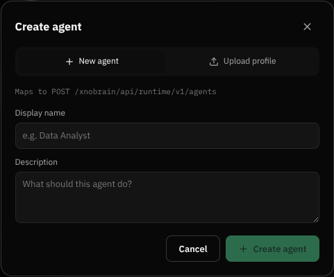

# BUG-001 — Agent creation exposes an internal API and silently disables submission

Severity: Medium  
Area: Agents / Create agent dialog  
Environment: local development, Chrome, 2026-08-14  
Reproducibility: 100% (2/2)

## Summary

The product-facing Create agent dialog displays the internal implementation string `Maps to POST /xnobrain/api/runtime/v1/agents`. Its required Display name field is not marked with `*` and has no inline validation message. With the field empty, **Create agent** is disabled, so attempting to proceed gives the user no explanation.

## Steps to reproduce

1. Sign in and open any agent conversation.
2. Click the `+` button beside **Agents**.
3. Leave **Display name** empty.
4. Inspect the dialog and the disabled **Create agent** button.

## Expected

- Product UI does not expose internal endpoint names.
- The required field is labeled `Display name *` (or equivalent accessible required indication).
- A clear validation message such as `Display name is required.` is shown when submission is unavailable or after an attempted submit.

## Actual

- The dialog renders `Maps to POST /xnobrain/api/runtime/v1/agents`.
- **Display name** has no required marker or message.
- **Create agent** is silently disabled.

## Impact

New users cannot tell why submission is unavailable, and internal API details leak into normal product presentation. This is inconsistent with the Blend form, which marks required fields and explains validation failures.

## Evidence

## Suggested fix

Remove the `Maps to POST ...` copy from the dialog. Add a visible `*`, `required`, and `aria-required="true"` to Display name. Keep an attempted-submit/touched state and render an inline `Display name is required.` message associated with the field using `aria-describedby`. Avoid relying only on a disabled primary button to communicate invalid state.
