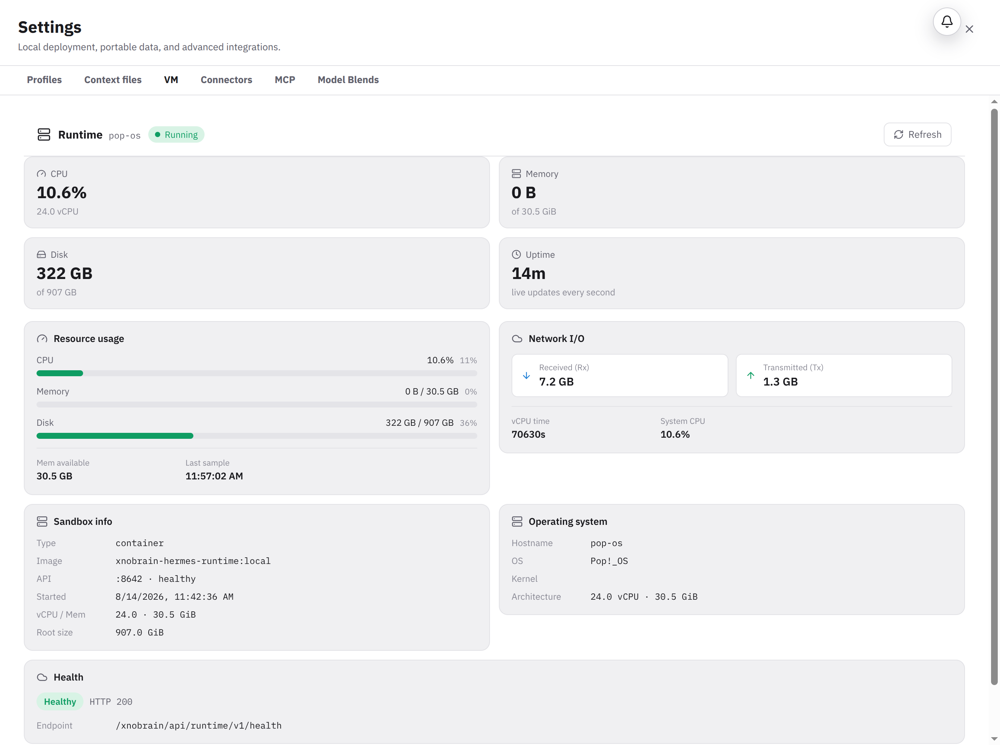

# BUG-002 — Runtime reports zero memory usage on this cgroup layout

Severity: Medium  
Area: Settings / Runtime metrics  
Environment: local development on Pop!_OS 24.04, Chrome, 2026-08-14  
Reproducibility: 100% across live metric refreshes

## Summary

Settings > Runtime displays `Memory 0 B of 30.5 GiB`, `0%`, and `Mem available 30.5 GB`. The runtime API likewise returns `memory_bytes: 0` and makes available bytes equal the full limit. The machine is actively running Chrome, Vite, the runtime, the router, and other processes, and `/proc/meminfo` reports only about 12.1 GiB available of 30.5 GiB—not full availability.

## Prerequisites

The local runtime stack is active and the authenticated Settings > Runtime page can read live host/cgroup metrics.

## Reproduction

1. Start the local stack with `make dev`.
2. Sign in and open **Settings > Runtime**.
3. Observe Memory and Mem available through multiple one-second updates.
4. Inspect `GET /xnobrain/api/runtime/v1/sandboxes/detail`.

## Expected

The Runtime page reports a non-zero, internally consistent memory-used value and an available value based on the applicable cgroup or host metrics.

## Actual

The live API returned:

```text
memory_bytes: 0
memory_limit_bytes: 32705605632
memory_available_bytes: 32705605632
```

At the same time `/proc/meminfo` returned `MemTotal: 31939068 kB` and `MemAvailable: 12696704 kB`.

## Root-cause evidence

`LocalRuntimeManager._memory_usage()` reads only cgroup-v2 root files `/sys/fs/cgroup/memory.current` and `/sys/fs/cgroup/memory.max`. Those paths are absent on this host. Its exception fallback sets `used = 0`, calculates only total physical memory, and returns `(0, total)`. A usable `/sys/fs/cgroup/memory.stat` exists, and `/proc/meminfo` provides a reliable host fallback.

## Impact

Operators see a healthy-looking 0% memory reading even when the runtime or host is under memory pressure. This makes the Runtime dashboard unreliable for diagnosis and capacity decisions.

## Evidence



## Suggested fix

Support both relevant cgroup layouts and resolve the process's actual cgroup path from `/proc/self/cgroup`. When no finite cgroup limit/current value is available, parse `/proc/meminfo` and compute host used memory as `MemTotal - MemAvailable` (with a documented fallback if `MemAvailable` is absent). Add tests for cgroup v2 finite limit, v2 unlimited, missing root files, and proc fallback; never return zero merely because the preferred cgroup files are missing.
