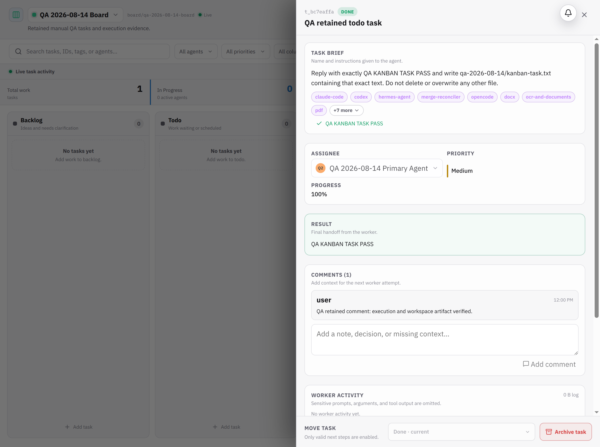
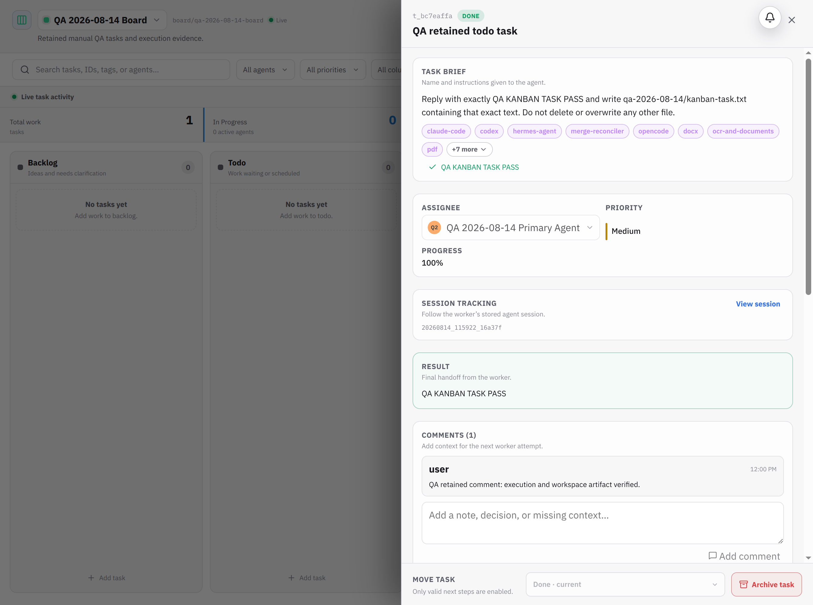

# BUG-003 — Reloaded Kanban task hides persisted worker activity and events until Refresh

Severity: High  
Area: Kanban / Task detail deep links  
Environment: local development, Chrome, 2026-08-14  
Reproducibility: 100% (3/3 reloads)

## Summary

Reloading a completed task detail URL renders the correct task, result, and run summary, but falsely shows `0 B log`, `No worker activity yet`, and `EVENT LOG (0)`. Waiting does not repair the view. Clicking the task detail's Refresh button immediately restores the persisted 3655-byte worker log, five structured worker activities, stored session ID, and seven events.

Test deep link:

```text
/kanban/boards/qa-2026-08-14-board/tasks/t_bc7eaffa
```

## Steps to reproduce

1. Create and run an assigned Kanban task that uses tools and completes.
2. Verify its detail drawer shows Worker Activity and Event Log entries.
3. Reload the task's deep-link URL.
4. Wait at least five seconds.
5. Observe empty activity/event sections.
6. Click **Refresh task details**.

## Expected

The deep link loads the full persisted task detail, including session tracking, worker log/activity, comments, run history, and events, without requiring a manual Refresh.

## Actual

After reload:

```text
WORKER ACTIVITY
0 B log
No worker activity yet.
EVENT LOG (0)
No events yet.
```

After clicking Refresh:

```text
SESSION TRACKING 20260814_115922_16a37f
WORKER ACTIVITY 3655 B log
RUN HISTORY (1)
EVENT LOG (7)
```

The detail API itself returns seven events and a populated `worker_activity`, so persisted data is not lost.

## Impact

Users opening or sharing task URLs believe execution evidence was lost. This directly undermines the durable-task UI and makes debugging completed work unreliable until the user discovers the unlabeled refresh workaround.

## Evidence

Before manual refresh:



After manual refresh:



## Suggested fix

When a route selects a task, always resolve the selected list DTO into `getTask(boardId, taskId)` detail data. Do not treat a task already present in the board list as a fully loaded detail record. Track detail freshness separately (for example `loadedDetailKey`) or check for detail-only fields, and fetch whenever the route opens/reloads or board/task key changes. Add a component/hook test that boots directly at a completed task URL and expects events and worker activity without clicking Refresh.
