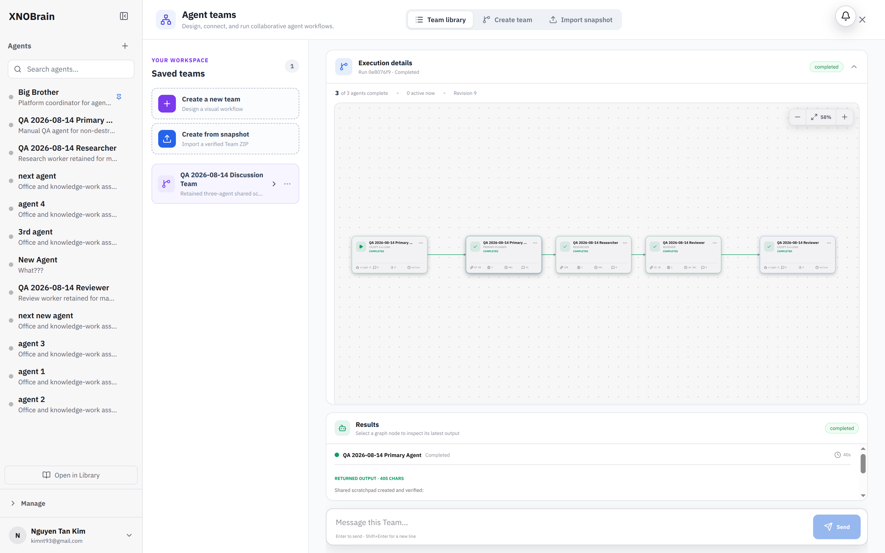

# BUG-004: Completed team run remains at 58% progress

## Severity

Medium — execution succeeds, but the progress display contradicts the terminal run state.

## Area

Teams → execution details

## Environment

Local development started with `make dev`, headed Chromium 148, tested 2026-08-14.

## Prerequisites

A retained multi-stage Team execution that has reached its terminal completed state.

## Reproduction

1. Create a three-stage team whose stages execute in dependency order.
2. Start a run and wait for all stages to finish.
3. Reload the run deep link.
4. Compare the completion counters and the displayed percentage.

Retained run:

- Team: `QA 2026-08-14 Discussion Team`
- Run: `tr_0e8076f946fe46288067c1c273abea67`

## Actual result

The run is `Completed`, reports `3 of 3 agents complete` and `0 active now`, but the progress value remains `58%`.

The retained run record also has status `completed` and revision `9`, while its top-level `completed_at` value is null.

## Expected result

A terminal run with every stage completed should display 100% progress. The persisted run should also record a completion timestamp so duration and terminal-state calculations have a reliable source.

## Reproducibility

Reproduced after reload on the retained completed discussion execution.

## Impact

Users cannot trust the progress indicator or determine whether more work remains.

## Suggested fix

- Derive terminal progress from completed executable stages, or explicitly clamp successful terminal runs to 100%.
- Do not include coordinator/graph bookkeeping nodes in the denominator unless they are also represented in the visible completed count.
- Persist `completed_at` during the same atomic transition that sets run status to `completed`.
- Add a regression test for a three-stage sequential run asserting `completed`, `3 / 3`, `0 active`, and `100%` after reload.

## Evidence

