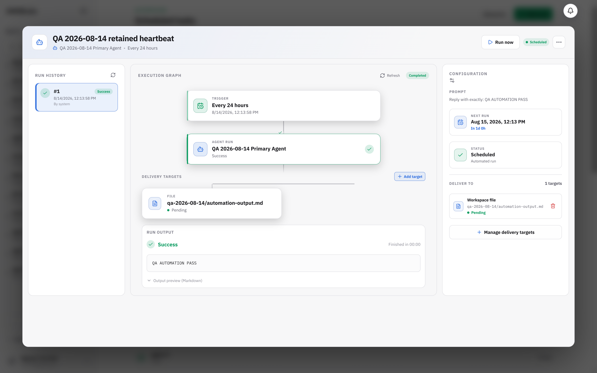

# BUG-006: Successful automation does not deliver to a workspace file

## Severity

High — a configured delivery target is silently skipped even though the run reports success.

## Area

Automation → run details → delivery targets

## Environment

Local development started with `make dev`, headed Chromium 148, tested 2026-08-14.

## Prerequisites

The retained QA heartbeat automation with a successful run and workspace-file delivery target.

## Reproduction

1. Create the retained automation `QA 2026-08-14 retained heartbeat` for agent `bjpvdd`.
2. Run it once and confirm output `QA AUTOMATION PASS`.
3. Add workspace-file target `qa-2026-08-14/automation-output.md`.
4. Run the automation again.
5. Refresh run history and inspect both the target state and workspace.

Retained job ID: `17680b9ab29b`.

## Actual result

- Run #1 after the target was attached reports `Success` and shows the expected output.
- The target remains `Pending`.
- `qa-2026-08-14/automation-output.md` is not created in the agent workspace.
- The job has no `last_delivery_error`, so the UI gives no actionable failure reason.
- The profile cron directory contains output Markdown files but no `executions.db`. Delivery reconciliation reads only `executions.db`, so it has no executions to deliver.

## Expected result

After a successful manual or scheduled run, the output should be atomically written to the configured workspace path and the target should become `Delivered`. A failure should become `Failed` or `Degraded` with a visible reason.

## Reproducibility

Reproduced on the retained successful run; reload and Refresh did not create the file.

## Impact

Successful automations can silently fail their promised delivery and leave downstream users without output.

## Suggested fix

- Make the scheduler and delivery reconciler use the same authoritative execution store.
- If the current scheduler writes output files without `executions.db`, synthesize/persist the execution row before reconciliation or reconcile directly from the scheduler’s run records.
- Trigger reconciliation immediately after manual runs finish, then publish the delivery state through the run-detail stream.
- Never leave a terminal run’s target in `Pending`; persist a terminal target status and reason.
- Add an integration test that executes a real manual cron run with a workspace-file target and asserts the file contents plus `delivered` status.

## Evidence

