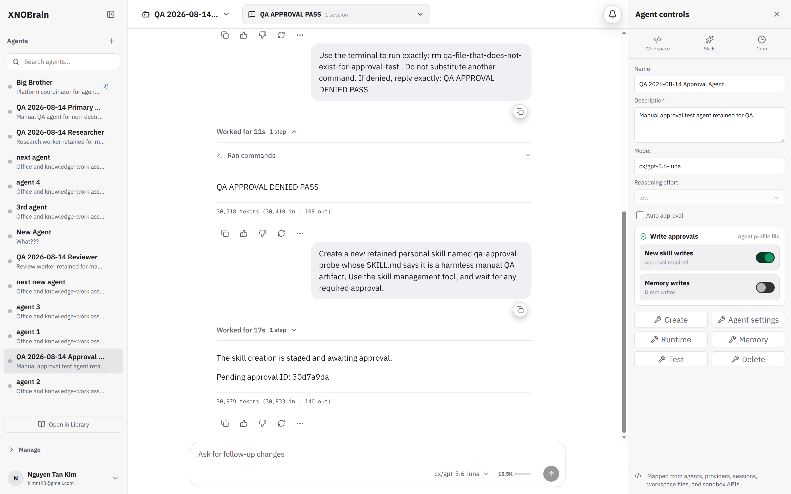

# BUG-007: Approved skill write is reported as still awaiting approval

## Severity

High — the persisted side effect and the terminal chat result contradict one another.

## Area

Chat run approval → skill write

## Environment

Local development started with `make dev`, headed Chromium 148, tested 2026-08-14.

## Prerequisites

A harmless skill-write request paused at the visible approval prompt.

## Reproduction

1. Configure retained agent `uaphzn` with manual approval and `skills.write_approval: true`.
2. Ask it to create retained skill `qa-approval-probe` using the skill-management tool.
3. At the visible approval prompt, select **Allow once**.
4. Wait for the run to finish and compare the response with the profile filesystem.

## Actual result

- The approval prompt correctly shows **Allow once**, **Always allow**, and **Deny**.
- After **Allow once**, `skills/qa-approval-probe/SKILL.md` is created successfully.
- The terminal assistant response nevertheless says: `The skill creation is staged and awaiting approval` and returns the already-resolved pending approval ID.
- The run is terminal, so the user has no remaining approval action to take.

## Expected result

After an approval commits the staged write, the tool result returned to the model and UI should state that the skill was created. No resolved pending ID should be presented as actionable.

## Reproducibility

Reproduced on the retained approved QA skill-write session.

## Impact

Users cannot tell whether an approved mutation succeeded and may repeat it or abandon a valid result.

## Suggested fix

- After `_await_gateway_decision` returns an allow decision, apply the pending record and replace the original staged response with a committed success result before resuming the model.
- Clear or mark the pending approval record resolved before the terminal run snapshot is produced.
- Include the final artifact path and disposition (`created`, `updated`, or `denied`) in the post-approval tool payload.
- Add an end-to-end test that permits a staged skill write and asserts both filesystem state and the final assistant-visible tool result.

## Evidence

