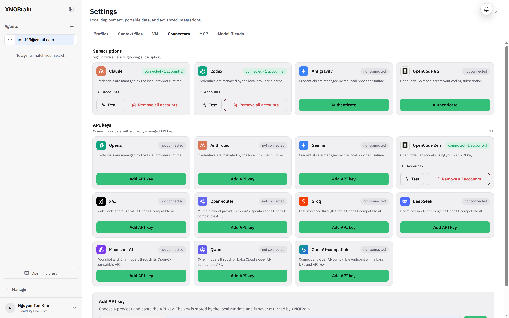

# BUG-009: Browser autofill hides every agent in the sidebar

## Severity

Medium — navigation appears to lose all agents until the user notices and clears an unexpected filter.

## Area

Global sidebar → Search agents

## Environment

Local development started with `make dev`, headed Chromium 148 with saved login autofill, tested 2026-08-14.

## Prerequisites

An authenticated browser profile that remembers the login email.

## Reproduction

1. Log in using Chrome with saved or recently entered account credentials.
2. Navigate among agent and Settings pages, including `/settings/connectors`.
3. Inspect the **Search agents…** field and sidebar list.

## Actual result

Chrome autofills the agent-search input with the signed-in account email address. The sidebar then displays `No agents match your search.` even though 13 agents are loaded. Clearing the field immediately restores all 13 rows.

The evidence image intentionally demonstrates the state but this report does not repeat the account value.

## Expected result

The agent filter should remain empty unless the user deliberately enters a search term, and credential autofill must never target it.

## Reproducibility

Reproduced after login/reload with the retained headed-browser profile.

## Impact

Autofill makes the agent library appear empty and can mislead users into believing profiles were deleted.

## Suggested fix

- Give the control a stable non-credential `name`, `type="search"`, and an appropriate autocomplete hint such as `autocomplete="off"`/`autocomplete="nope"` after testing against supported Chrome versions.
- Place authentication forms in semantically distinct forms with correct `username` and `current-password` autocomplete tokens so Chrome does not infer unrelated text fields.
- Ignore browser-originated changes during initial hydration unless the field is focused or has received an input event trusted as user interaction.
- Add an authenticated Chrome test that reloads Settings and asserts the agent-search value is empty and agent rows remain visible.

## Evidence

