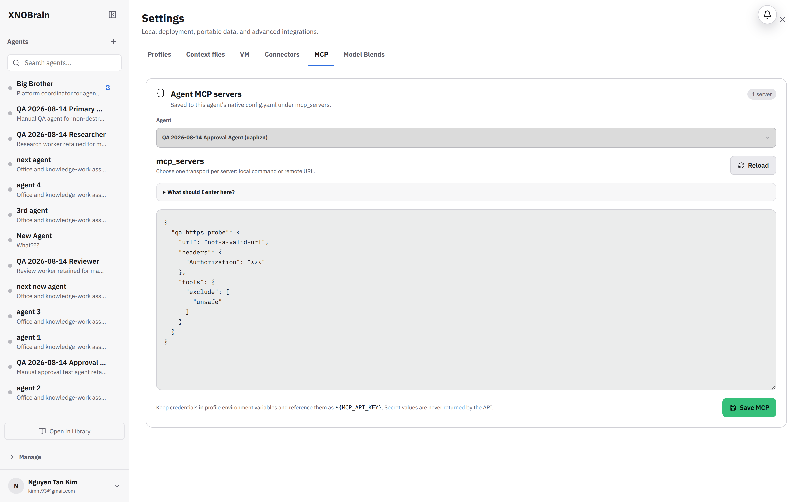

# BUG-011: MCP editor accepts and persists invalid server schemas

## Severity

High — malformed MCP configuration is accepted as valid and can break subsequent agent startup/tool discovery.

## Area

Settings → MCP

## Environment

Local development started with `make dev`, headed Chromium 148, tested 2026-08-14.

## Prerequisites

The retained QA agent selected in the MCP JSON editor; no external process was intentionally launched.

## Reproduction

1. Open `/settings/mcp` and select retained QA agent `uaphzn`.
2. Enter a syntactically valid object with a numeric command, for example `{"qa_stdio_probe":{"command":123}}`.
3. Select **Save MCP**.
4. Enter a remote server with `url: "not-a-valid-url"` and save again.
5. Reload the editor.

## Actual result

- Both payloads are accepted.
- The UI reports `MCP configuration saved. New agent runs will use the updated servers.`
- The malformed URL remains persisted after Reload.
- JSON syntax errors are rejected, and secret-like header values are masked correctly, but field types, transport one-of rules, and URL format are not validated.

The retained QA configuration is named `qa_https_probe` so it is identifiable during review.

## Expected result

Each server should satisfy a strict schema before persistence:

- exactly one transport: non-empty string `command` or absolute supported `http(s)` URL;
- `args` is an array of strings;
- `env` and `headers` are string maps;
- include/exclude tool filters are arrays of non-empty strings;
- unsupported keys and ambiguous command-plus-URL definitions receive field-specific feedback.

## Reproducibility

Reproduced with malformed stdio command types and malformed HTTPS URLs, including after reload.

## Impact

Invalid integration definitions persist until runtime, where they can fail unpredictably or launch unintended commands.

## Suggested fix

- Validate with the same typed schema on both frontend and backend; the backend remains authoritative.
- Return structured field paths such as `qa_https_probe.url` and render them next to the editor.
- Parse URL values and restrict accepted schemes to transports supported by the MCP client.
- Apply changes atomically only after the full object validates.
- Add API and UI tests for wrong scalar types, missing transports, both transports, invalid URLs, malformed env/header maps, and tool filters.

## Evidence

